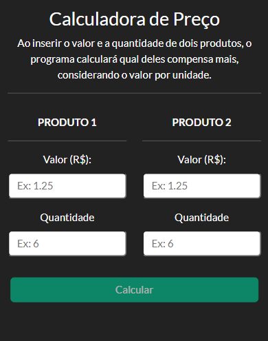

# Calculadora de Preços

O programa auxilia o usuário na hora de comparar preços entre dois produtos, informando qual compensa mais mediante a inserção do preço e da quantidade.


## Stack utilizada

JavaScript, Node, Express, Docker, Bootstrap


## Rodando localmente

Clone o projeto

```bash
  git clone https://github.com/mattborgesdev/calculadora-de-precos
```

Entre no diretório do projeto

```bash
  cd calculadora-de-precos
```

Instale as dependências

```bash
  npm install
```

Inicie o servidor

```bash
  npm run start
```


## Screenshots



